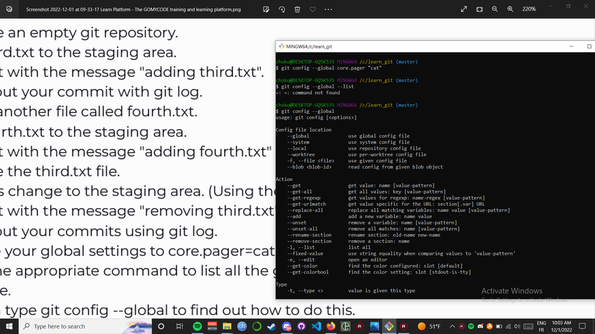

# GMC
cd learn_git

Creation third.txt

initialisation

add third

first commit

log

creation fourth

first commit

remove third.txt

new git add, git commit -m "removed third.txt and added fourth.txt", git log

git config --global  core.paper "cat"
git config --global affichage

++Bonus pushing to github online

